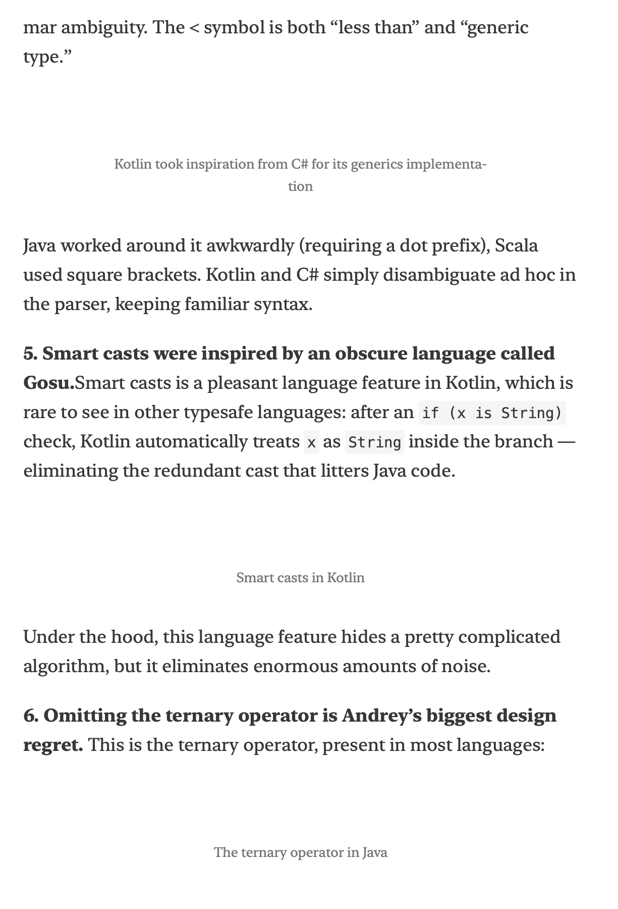

+++
title = 'Replacing SaaS with an Hour of AI Coding'
date = 2026-02-23
draft = false
+++
# Substack to Kindle
I read quite a lot of newsletters, mostly through Substack. I've always wanted to have them on my Kindle to read without any additional distractions. This is easy to do with "Send to Kindle", although there is still a conversion step from HTML to EPUB. For a long time I've been using a browser plugin ([Reabble](https://send.reabble.com/)) but this relied on manually clicking convert/send for each newsletter. There were some tools that would do this automatically (e.g. [KTool](https://ktool.io/)), but they were paid and I've decided I don't need yet another subscription in my life.

So this project joined my ever-growing list of fun ideas to explore and waited for a day where I had both time and energy to finally dig deeper. Eventually I decided to give Claude Code a try. I have been using AI for other tasks, including home automation where it sped me up massively. I already had a rough spec in my mind and dumping it into text seemed like a smaller commitment than writing everything by hand.

This worked out surprisingly well, but also highlighted some issues with AI coding assistants, which prompted me to write this short post.


If you are interested in the final code, you can find it [here](https://github.com/obrep/substack-to-kindle).


## The setup
- I receive multiple newsletters that I'd like to read on my Kindle
- Some of the newsletters are paid and require log in if not opened from email
- Specific file format is required (EPUB)
- Conversion can be handled with [Calibre](https://calibre-ebook.com/)
- Files can be sent over the internet with [Send to Kindle](https://www.amazon.com/sendtokindle)

Basically I just need to glue the entire process together. Since I subscribe using my main email, exposing its credentials was not an option. Ideally I'd run everything locally without exposing anything to the outside world. I have a Synology NAS which acts as my home server and already runs things like AdGuard, Home Assistant, and Plex. New containers can be easily spun up there and run uninterrupted.

## Initial attempt

I started with a short discussion with Claude on how to structure everything with a few doubts around handling authentication. I didn't find a more promising option than simply creating a new email specifically for this purpose. Fortunately Gmail is still free and allows for [app passwords](https://support.google.com/mail/answer/185833?hl=en), which greatly simplify the process.

Once I had the spec refined I handed it off to Claude along with a couple of example emails containing newsletters, hoping it could figure out the patterns by itself.

And it did! Mostly. The first attempt worked but had several issues with parsing the content and quite a few design choices that were questionable at best.

## Fixing the mistakes

A newsletter email is basically HTML being rendered by your browser or email client. This makes it easy to navigate using tags. Instead of doing that, Claude decided to create a lot of "cruft" rules targeting specific text patterns 🙈. This resulted in several hundred lines of code that scan the HTML of each email trying to match patterns and modify or remove content. It often failed because the model extracted patterns from each example individually, instead of looking for a more structured approach. I asked it to identify patterns based on HTML tags and simplify the system, which cleaned things up significantly.
Once the cruft was out I quickly noticed another issue with some newsletters - instead of extracting the main text, it was only grabbing the intro blurb attached to some posts (e.g. "this is a free issue" followed by an image). After pointing this out, Claude was able to adjust the extraction logic to pull the full article content.
Another "interesting" choice the model made was maintaining an in-memory cache of emails that had already been processed. While there was nothing wrong with this approach given my spec, it introduced unnecessary problems — how do you persist the cache if the container restarts? The much simpler approach was to just use the built-in IMAP functionality and mark each email as read once it's processed.

## Finishing touches
At this point the system was already working and doing what I wanted - letting me read newsletters on my Kindle. I started adding some nice-to-have features that I enjoyed or missed from my previous approach:

1. Removing hyperlinks. The Kindle's built-in browser is painfully slow and it annoyed me enormously whenever I accidentally tapped an image that linked to external content. The first attempt removed links but also stripped out the images themselves. The second attempt was much better, though some leftover images at the bottom still needed cleaning up. After one more round of tweaking, we got to a good place.

  <figure class="grid-w50">
    
    <figcaption>Links removed, along with images</figcaption>
  </figure>
  <figure class="grid-w50">
    
    <figcaption>Fixed version - images preserved</figcaption>
  </figure>


2. Generating cover images.  Using the title, author name, and graphics from the article itself, we can generate a simple cover for each post. This makes it much easier to distinguish between different newsletters when browsing.
3. Filtering out non-article emails. Substack sends payment receipts and other transactional emails that I don't want on my Kindle. These are easy to filter by looking at the subject line.

## Final result



All in all it took me less than an hour (+ another 30 minutes troubleshooting DNS issues with docker builds on NAS :see_no_evil: ) to get to a state I'm satisfied with and can see myself easily modifying/extending in the future. The service has been running for the past few days without a hitch and I'm enjoying my daily dose of distraction-free reading.

## Summary

Is the code perfect? No. Could I have done a better job by myself? Definitely. But I'm not sure when that would have finally happened, given how I procrastinated on this idea for the past year. I can't say I learned as much as I would have doing it by hand, but I got a lot of joy from building it - and it actually exists now.

During the process I kept thinking about other small SaaS offerings that can now be easily replaced. As shown above, this is not something requiring deep technical expertise anymore, at least not at this level of complexity. Given my experience I was able to spot issues quickly and correct the model before the damage was too much to undo without a full rewrite. That to me is the key takeaway — AI coding assistants are great at getting you from zero to something functional fast, but you still need to know enough to steer them in the right direction if you want to be able to maintain it.
